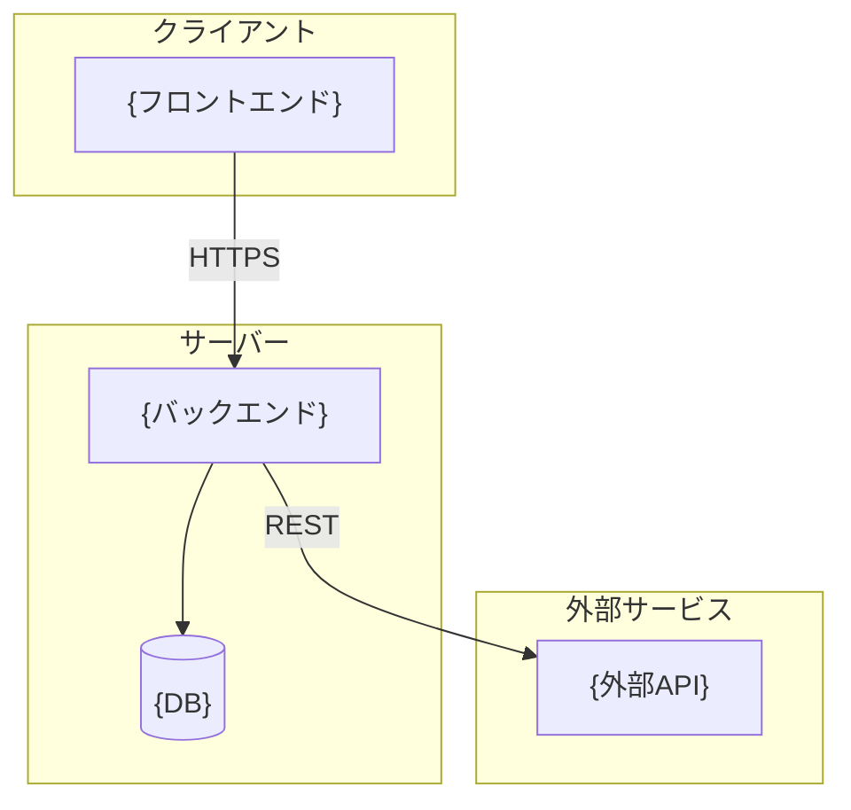
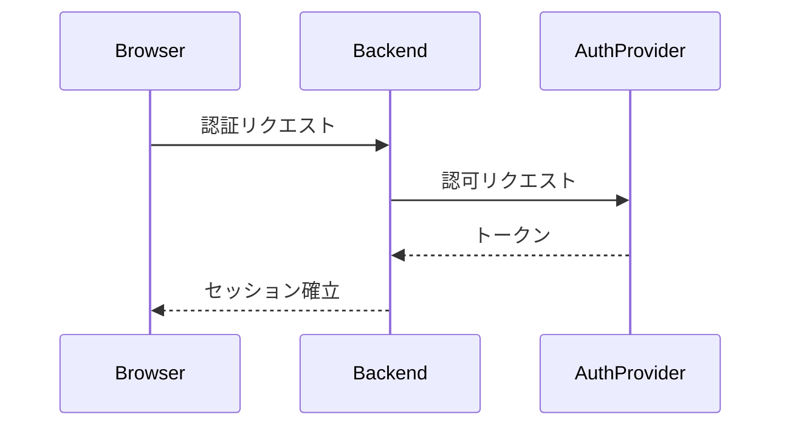

# アーキテクチャ設計書: {プロジェクト名}

## 目次
1. [はじめに](#1-はじめに)
2. [アーキテクチャ概要](#2-アーキテクチャ概要)
3. [バックエンド設計](#3-バックエンド設計)
4. [フロントエンド設計](#4-フロントエンド設計)
5. [インフラ構成](#5-インフラ構成)
6. [セキュリティ設計](#6-セキュリティ設計)
7. [外部API統合設計](#7-外部api統合設計)
8. [横断的関心事](#8-横断的関心事)

---

## 1. はじめに

### 1.1 本ドキュメントの目的
技術的なアーキテクチャを定義し、「どう作るか」の指針を示す。

### 1.2 関連ドキュメント
| ドキュメント | ファイル |
|-------------|---------|
| 要件定義書 | docs/requirements.md |
| 基本設計書 | docs/basic-functional-design.md |
| リポジトリ定義書 | docs/repository-structure.md |
| 開発ガイドライン | docs/development-guidelines.md |

---

## 2. アーキテクチャ概要

### 2.1 アーキテクチャパターン
**{パターン名}** を採用する。

| 選定理由 |
|---------|
| {理由1} |
| {理由2} |

### 2.2 レイヤー構成

```
┌─────────────────────────────────────────────────┐
│                Presentation Layer                │
│         {フロントエンド技術}                        │
├─────────────────────────────────────────────────┤
│                  API Layer                       │
│     REST Controller                              │
├─────────────────────────────────────────────────┤
│                Service Layer                     │
│     ビジネスロジック / ユースケース                    │
├─────────────────────────────────────────────────┤
│              Integration Layer                   │
│     {外部APIクライアント}                            │
├─────────────────────────────────────────────────┤
│              Persistence Layer                   │
│     {ORM} / {DB}                                 │
└─────────────────────────────────────────────────┘
```

### 2.3 システム全体構成図



---

## 3. バックエンド設計

### 3.1 技術スタック

| カテゴリ | 技術 | バージョン |
|---------|------|----------|
| 言語 | {言語} | {バージョン} |
| フレームワーク | {FW} | {バージョン} |
| ORM | {ORM} | {バージョン} |
| セキュリティ | {セキュリティ} | - |
| テスト | {テストFW} | - |

### 3.2 パッケージ構成

```
{ベースパッケージ}
├── {MainClass}.java
├── controller/
├── service/
├── repository/
├── domain/
│   ├── entity/
│   └── enums/
├── client/
├── dto/
├── config/
└── exception/
```

---

## 4. フロントエンド設計

### 4.1 技術スタック

| カテゴリ | 技術 |
|---------|------|
| フレームワーク | {FW} |
| 状態管理 | {状態管理} |
| HTTPクライアント | {HTTPクライアント} |

### 4.2 ディレクトリ構成

```
frontend/src/
├── {エントリポイント}
├── pages/
├── components/
├── {状態管理ディレクトリ}/
├── api/
├── types/
└── utils/
```

---

## 5. インフラ構成

### 5.1 環境分離

| 環境 | 用途 | 構成 |
|------|------|------|
| dev | 開発 | {構成} |
| prod | 本番 | {構成} |

---

## 6. セキュリティ設計

### 6.1 認証フロー



---

## 7. 外部API統合設計

### 7.1 {外部API名}クライアント設計

| 項目 | 仕様 |
|------|------|
| レート制限 | {制限内容} |
| リトライ戦略 | {戦略} |
| タイムアウト | {時間} |

---

## 8. 横断的関心事

### 8.1 エラーレスポンス形式

```json
{
  "error": {
    "code": "{ERROR_CODE}",
    "message": "{エラーメッセージ}",
    "details": {}
  }
}
```

### 8.2 ログ設計

| レベル | 用途 |
|--------|------|
| ERROR | 即時対応が必要なエラー |
| WARN | 注意が必要な事象 |
| INFO | 主要な業務イベント |
| DEBUG | 開発時のデバッグ情報 |

### 8.3 設定管理

#### 環境変数一覧

| 変数名 | 説明 | 取得元 |
|--------|------|-------|
| {変数名} | {説明} | {取得元} |

---

## 更新履歴
- {YYYY-MM-DD}: 初版作成
