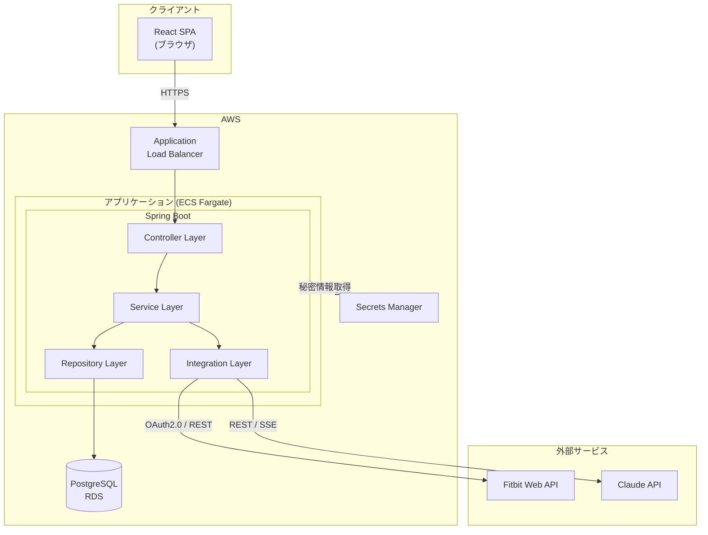
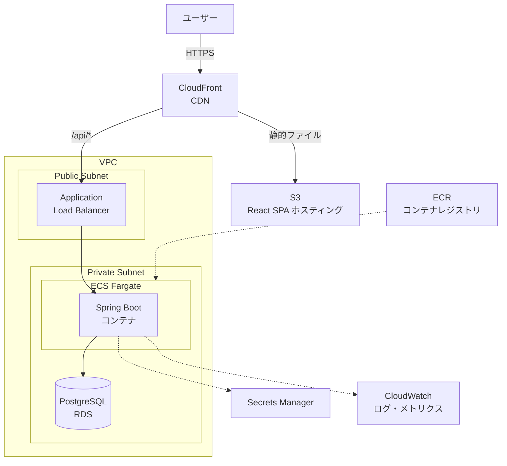
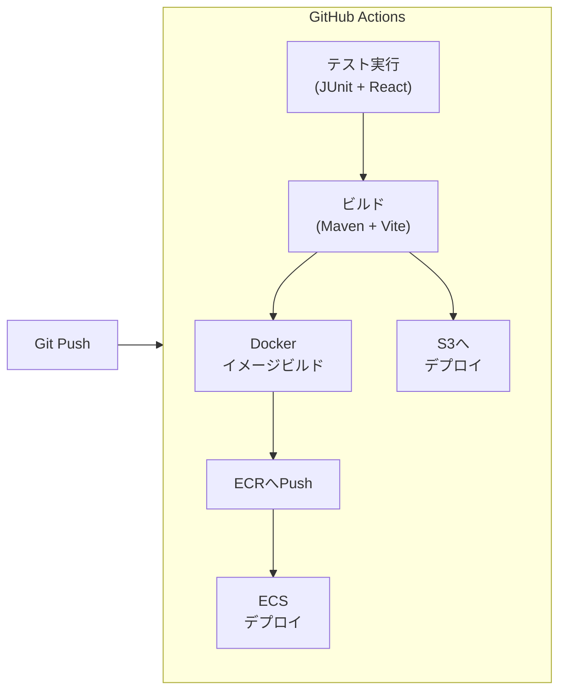
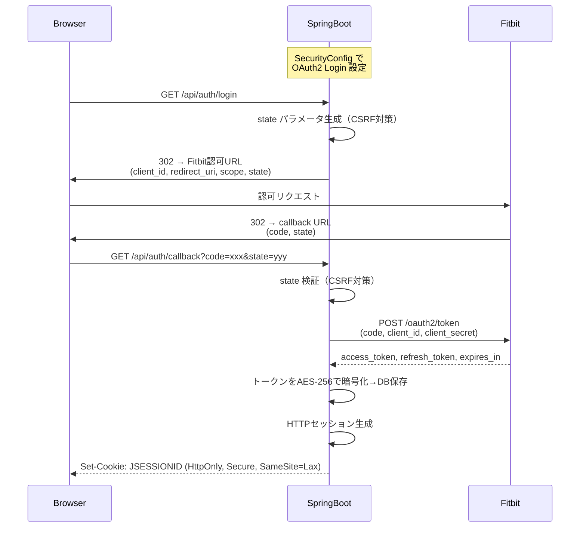
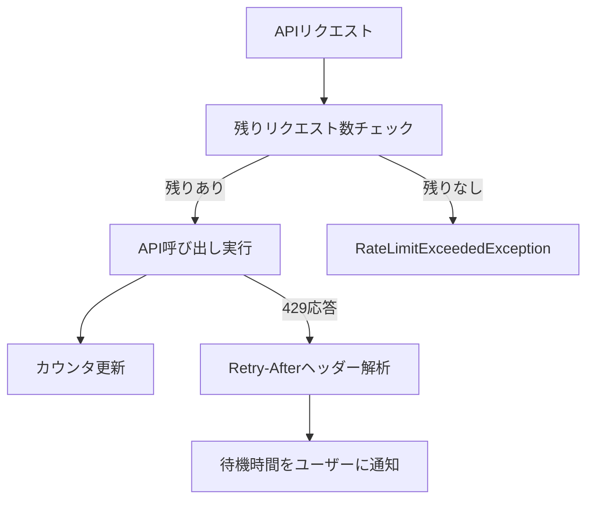

# アーキテクチャ設計書: Fitbit Body Management AI Agent

## 目次
1. [はじめに](#1-はじめに)
2. [アーキテクチャ概要](#2-アーキテクチャ概要)
3. [バックエンド設計](#3-バックエンド設計)
4. [フロントエンド設計](#4-フロントエンド設計)
5. [インフラ構成](#5-インフラ構成)
6. [セキュリティ設計](#6-セキュリティ設計)
7. [外部API統合設計](#7-外部api統合設計)
8. [横断的関心事](#8-横断的関心事)

---

## 1. はじめに

### 1.1 本ドキュメントの目的
本ドキュメントは、基本設計書で定義した機能・データモデル・データフローを実現するための
技術的なアーキテクチャを定義する。「どう作るか」の構造を明確にし、実装の指針とする。

### 1.2 対象読者
- 開発チーム（バックエンド / フロントエンド）
- インフラチーム

### 1.3 関連ドキュメント
| ドキュメント | ファイル |
|-------------|---------|
| 企画書 | docs/planning.md |
| 要件定義書 | docs/requirements.md |
| 基本設計書 | docs/basic-functional-design.md |
| リポジトリ定義書 | docs/repository-structure.md |
| 開発ガイドライン | docs/development-guidelines.md |
| チケット管理 | .steering/tasklist.md |
| 技術Q&A | .questions/question-{日付}.md |

---

## 2. アーキテクチャ概要

### 2.1 アーキテクチャパターン

**レイヤードアーキテクチャ**を採用する。

| 選定理由 |
|---------|
| Spring Bootエコシステムとの親和性が高い |
| チームの学習コストが低い |
| MVPの規模感（13機能・8画面）に対して適切な複雑度 |
| 各レイヤーの責務が明確で保守性が高い |

### 2.2 レイヤー構成

```
┌─────────────────────────────────────────────────┐
│                Presentation Layer                │
│         React SPA (ブラウザ)                       │
├─────────────────────────────────────────────────┤
│                  API Layer                       │
│     REST Controller / SSE Endpoint               │
├─────────────────────────────────────────────────┤
│                Service Layer                     │
│     ビジネスロジック / ユースケース                    │
├─────────────────────────────────────────────────┤
│              Integration Layer                   │
│     Fitbit API Client / Claude API Client         │
├─────────────────────────────────────────────────┤
│              Persistence Layer                   │
│     Mapper (MyBatis) / PostgreSQL                 │
└─────────────────────────────────────────────────┘
```

**依存ルール**: 上位レイヤーから下位レイヤーへの一方向のみ依存を許可する。

### 2.3 システム全体構成図



---

## 3. バックエンド設計

### 3.1 技術スタック

| カテゴリ | 技術 | バージョン |
|---------|------|----------|
| 言語 | Java | 21 |
| フレームワーク | Spring Boot | 3.x |
| ORM | MyBatis | 3.0.3 |
| セキュリティ | Spring Security + OAuth2 Client | - |
| DB マイグレーション | Flyway | - |
| HTTP クライアント | Spring WebClient (WebFlux) | - |
| バリデーション | Hibernate Validator | - |
| ロギング | Logback | - |
| テスト | Spock Framework + Groovy + Testcontainers | - |
| ビルド | Maven | - |

### 3.2 パッケージ構成

```
com.fitbitagent
├── FitbitAgentApplication.java          # エントリポイント
├── controller/                          # API Layer
│   ├── AuthController.java              #   認証エンドポイント
│   ├── SyncController.java              #   データ同期エンドポイント
│   ├── DashboardController.java         #   ダッシュボードエンドポイント
│   ├── GoalController.java              #   目標管理エンドポイント
│   ├── AdviceController.java            #   AIアドバイスエンドポイント
│   └── ChatController.java             #   チャットエンドポイント
├── service/                             # Service Layer
│   ├── AuthService.java                 #   認証ビジネスロジック
│   ├── UserService.java                 #   ユーザー管理
│   ├── SyncService.java                 #   データ同期ロジック
│   ├── DashboardService.java            #   ダッシュボードデータ集計
│   ├── GoalService.java                 #   目標管理ロジック
│   ├── AdviceService.java               #   AIアドバイス生成ロジック
│   └── ChatService.java                #   チャットセッション管理
├── repository/                          # Persistence Layer
│   ├── UserRepository.java
│   ├── OAuthTokenRepository.java
│   ├── BodyRecordRepository.java
│   ├── ActivityRecordRepository.java
│   ├── SleepRecordRepository.java
│   ├── NutritionRecordRepository.java
│   ├── HeartRateRecordRepository.java
│   ├── GoalRepository.java
│   ├── AiAdviceRepository.java
│   └── ChatMessageRepository.java
├── domain/                              # Domain Model
│   ├── entity/                          #   DBテーブルに対応するPOJO（Plain Old Java Object）
│   │   ├── User.java
│   │   ├── OAuthToken.java
│   │   ├── BodyRecord.java
│   │   ├── ActivityRecord.java
│   │   ├── SleepRecord.java
│   │   ├── NutritionRecord.java
│   │   ├── HeartRateRecord.java
│   │   ├── Goal.java
│   │   ├── AiAdvice.java
│   │   └── ChatMessage.java
│   └── enums/                           #   列挙型
│       ├── GoalType.java                #     weight/steps/calories_burned/calories_intake
│       ├── AdviceType.java              #     daily/weekly
│       └── ChatRole.java               #     user/assistant
├── client/                              # Integration Layer
│   ├── fitbit/
│   │   ├── FitbitApiClient.java         #   Fitbit API呼び出し
│   │   ├── FitbitOAuthClient.java       #   OAuth2.0トークン管理
│   │   ├── FitbitRateLimiter.java       #   レート制限制御
│   │   └── dto/                         #   Fitbit APIレスポンスDTO
│   │       ├── FitbitProfileResponse.java
│   │       ├── FitbitBodyResponse.java
│   │       ├── FitbitActivityResponse.java
│   │       ├── FitbitSleepResponse.java
│   │       ├── FitbitFoodResponse.java
│   │       └── FitbitHeartRateResponse.java
│   └── claude/
│       ├── ClaudeApiClient.java         #   Claude API呼び出し
│       ├── PromptBuilder.java           #   プロンプト構築
│       └── dto/
│           ├── ClaudeRequest.java
│           └── ClaudeResponse.java
├── dto/                                 # APIリクエスト/レスポンスDTO
│   ├── request/
│   │   ├── GoalCreateRequest.java
│   │   └── ChatMessageRequest.java
│   └── response/
│       ├── DashboardSummaryResponse.java
│       ├── ChartDataResponse.java
│       ├── GoalResponse.java
│       ├── AdviceResponse.java
│       ├── SyncResultResponse.java
│       ├── WeeklyReportResponse.java
│       └── ErrorResponse.java
├── config/                              # 設定
│   ├── SecurityConfig.java              #   Spring Security設定
│   ├── WebConfig.java                   #   CORS設定
│   ├── FitbitConfig.java                #   Fitbit API設定値
│   ├── ClaudeConfig.java               #   Claude API設定値
│   └── MyBatisConfig.java              #   MyBatis設定
└── exception/                           # 例外
    ├── GlobalExceptionHandler.java      #   グローバル例外ハンドラー
    ├── FitbitApiException.java          #   Fitbit API関連例外
    ├── ClaudeApiException.java          #   Claude API関連例外
    ├── RateLimitExceededException.java  #   レート制限超過
    └── ResourceNotFoundException.java   #   リソース未発見
```

### 3.3 レイヤー責務定義

| レイヤー | 責務 | やらないこと |
|---------|------|------------|
| Controller | HTTPリクエスト/レスポンス変換、入力バリデーション | ビジネスロジック、DB直接アクセス |
| Service | ビジネスロジック、トランザクション管理、DTO変換 | HTTP関連処理、外部API直接呼び出し |
| Repository | データアクセス、クエリ定義 | ビジネスロジック |
| Client | 外部API通信、レスポンスマッピング | ビジネスロジック、DB直接アクセス |
| Domain | エンティティ定義、値オブジェクト | 他レイヤーへの依存 |

### 3.4 主要な内部API設計

| メソッド | エンドポイント | Controller | 機能ID |
|---------|--------------|-----------|--------|
| GET | `/api/auth/login` | AuthController | FR-001 |
| GET | `/api/auth/callback` | AuthController | FR-001 |
| POST | `/api/auth/logout` | AuthController | FR-003 |
| GET | `/api/users/me` | AuthController | FR-002 |
| PUT | `/api/users/me` | AuthController | FR-002 |
| POST | `/api/sync` | SyncController | FR-010 |
| GET | `/api/dashboard/summary` | DashboardController | FR-020 |
| GET | `/api/dashboard/charts/{type}` | DashboardController | FR-021 |
| GET | `/api/dashboard/progress` | DashboardController | FR-022 |
| GET | `/api/goals` | GoalController | FR-030, FR-031 |
| POST | `/api/goals` | GoalController | FR-030, FR-031 |
| PUT | `/api/goals/{id}` | GoalController | FR-030, FR-031 |
| DELETE | `/api/goals/{id}` | GoalController | FR-030, FR-031 |
| POST | `/api/advice/daily` | AdviceController | FR-040 |
| GET | `/api/advice/daily/{date}` | AdviceController | FR-040 |
| POST | `/api/advice/weekly` | AdviceController | FR-041 |
| GET | `/api/advice/weekly` | AdviceController | FR-041 |
| POST | `/api/chat/messages` | ChatController | FR-042 |
| GET | `/api/chat/sessions/{id}/messages` | ChatController | FR-042 |

---

## 4. フロントエンド設計

### 4.1 技術スタック

| カテゴリ | 技術 | 理由 |
|---------|------|------|
| フレームワーク | Vue.js 3 + TypeScript | Composition API による直感的なコンポーネント設計 |
| ビルドツール | Vite (Rollup) | 高速な開発サーバー・本番ビルド |
| ルーティング | Vue Router 4 | Vue 公式ルーティングライブラリ |
| 状態管理 | Pinia | Vue 公式状態管理・シンプルなストア設計 |
| HTTP クライアント | Axios | インターセプター・エラーハンドリング |
| UIコンポーネント | Tailwind CSS | ユーティリティファースト・高速なUI構築 |
| アニメーション | vue-next-anime.js | Vue 3対応アニメーションライブラリ |
| DI | tsyringe | TypeScript向けDIコンテナ（サービス層の依存管理） |
| バリデーション | vee-validate | Vue 3対応フォームバリデーション |
| テスト | Vitest + Vue Test Utils | 高速単体テスト・Viteネイティブ |

### 4.2 ディレクトリ構成

```
frontend/src/
├── main.ts                        # エントリポイント
├── App.vue                        # ルートコンポーネント・ルーティング定義
├── pages/                         # ページコンポーネント（画面単位）
│   ├── LoginPage.vue              #   SCR-001
│   ├── DashboardPage.vue          #   SCR-002
│   ├── ChartDetailPage.vue        #   SCR-003
│   ├── GoalSettingPage.vue        #   SCR-004
│   ├── ChatPage.vue               #   SCR-005
│   ├── WeeklyReportPage.vue       #   SCR-006
│   ├── ProfilePage.vue            #   SCR-007
│   └── SettingsPage.vue           #   SCR-008
├── components/                    # 再利用可能なUIコンポーネント
│   ├── layout/
│   │   ├── Header.vue
│   │   ├── BottomNav.vue
│   │   └── AuthLayout.vue         #   認証済みレイアウト
│   ├── dashboard/
│   │   ├── SummaryCard.vue
│   │   ├── TrendChart.vue
│   │   ├── GoalProgress.vue
│   │   └── AdviceCard.vue
│   ├── chat/
│   │   ├── ChatMessage.vue
│   │   └── ChatInput.vue
│   └── common/
│       ├── LoadingSpinner.vue
│       ├── ErrorMessage.vue
│       └── EmptyState.vue
├── composables/                   # Composition API フック（useXxx）
│   ├── useAuth.ts                 #   認証状態管理
│   ├── useDashboard.ts            #   ダッシュボードデータ取得
│   ├── useGoals.ts                #   目標CRUD
│   ├── useAdvice.ts               #   AIアドバイス取得・再生成
│   ├── useChat.ts                 #   チャットメッセージ送受信
│   └── useSync.ts                 #   データ同期
├── stores/                        # Pinia ストア
│   ├── auth.ts                    #   認証状態・ユーザー情報
│   └── ui.ts                      #   グローバルUI状態（ローディング等）
├── api/                           # APIクライアント
│   ├── client.ts                  #   Axiosインスタンス・インターセプター
│   ├── authApi.ts
│   ├── dashboardApi.ts
│   ├── goalApi.ts
│   ├── adviceApi.ts
│   ├── chatApi.ts
│   └── syncApi.ts
├── types/                         # 型定義
│   ├── user.ts
│   ├── dashboard.ts
│   ├── goal.ts
│   ├── advice.ts
│   └── chat.ts
└── utils/                         # ユーティリティ関数
    ├── date.ts                    #   日付フォーマット
    └── number.ts                  #   数値フォーマット（カロリー等）
```

### 4.3 状態管理方針

| 状態の種類 | 管理方法 | 具体例 |
|-----------|---------|--------|
| サーバー状態 | Pinia + Axios（composables経由） | ダッシュボードデータ、目標、アドバイス |
| 認証状態 | Pinia（auth store）+ localStorage | ログイン状態、セッション情報 |
| UI状態 | ref / reactive（composables内） | モーダル開閉、フォーム入力値 |

**Piniaストア設計方針**:

| ストア | 管理対象 | 備考 |
|--------|---------|------|
| `auth.ts` | ログイン状態・ユーザー情報 | localStorage と同期 |
| `ui.ts` | グローバルローディング・トースト通知 | 画面横断的なUI状態 |

サーバーデータ（ダッシュボード・目標等）は各 composable 内で `ref` + Axios で管理し、Pinia には永続化が必要な状態のみ保持する。

### 4.4 API通信設計

```typescript
// api/client.ts の設計方針
// - ベースURL設定
// - リクエストインターセプター: CSRFトークンをヘッダーに付与
// - レスポンスインターセプター: 401時に Vue Router でログイン画面へリダイレクト
// - エラーレスポンスの統一的なハンドリング
```

**SSE（Server-Sent Events）によるチャットストリーミング**:
- `EventSource` APIを使用してサーバーからのストリーミング応答を受信
- チャンク受信ごとにメッセージ表示を更新（`ref` で反応的に表示）
- 接続エラー時は自動リトライ（最大3回）

---

## 5. インフラ構成

### 5.1 AWS構成図



### 5.2 AWSサービス一覧

| サービス | 用途 | 構成 |
|---------|------|------|
| CloudFront | CDN・リクエストルーティング | `/api/*` → ALB、その他 → S3 |
| S3 | React SPA ホスティング | 静的ファイル配信 |
| ALB | ロードバランサー | ヘルスチェック・HTTPS終端 |
| ECS Fargate | Spring Bootアプリ実行 | 最小1タスク（MVP） |
| ECR | Dockerイメージ保管 | Spring Bootコンテナ |
| RDS | PostgreSQL | db.t3.micro（MVP）|
| Secrets Manager | 秘密情報管理 | Fitbit/Claude APIキー、DB接続情報 |
| CloudWatch | ログ・メトリクス・アラーム | アプリログ集約・死活監視 |

### 5.3 環境分離

| 環境 | 用途 | 構成差分 |
|------|------|---------|
| dev | 開発・テスト | ローカルDocker Compose（PostgreSQL + Spring Boot） |
| prod | 本番 | AWS（上記構成） |

### 5.4 CI/CDパイプライン



**トリガー**:
- `main` ブランチへのマージ → prod デプロイ
- Pull Request → テスト実行のみ

---

## 6. セキュリティ設計

### 6.1 OAuth2.0認証フロー詳細



### 6.2 トークン暗号化方式

| 項目 | 仕様 |
|------|------|
| 暗号化アルゴリズム | AES-256-GCM |
| 暗号化キー | AWS Secrets Managerで管理 |
| 対象 | access_token, refresh_token |
| 保存先 | oauth_tokens テーブル（暗号化済み文字列） |

### 6.3 セッション管理

| 項目 | 設定 |
|------|------|
| セッションストア | サーバーメモリ（MVP）→ Redis（スケール時） |
| セッションタイムアウト | 30分（非活動時） |
| Cookie属性 | HttpOnly, Secure, SameSite=Lax |

### 6.4 CORS設定

```
許可オリジン: https://<frontend-domain> (本番), http://localhost:5173 (開発)
許可メソッド: GET, POST, PUT, DELETE
許可ヘッダー: Content-Type, X-CSRF-TOKEN
資格情報: credentials: true（Cookie送信のため）
```

### 6.5 CSRF対策

| 項目 | 仕様 |
|------|------|
| 方式 | Synchronizer Token Pattern |
| トークン送信 | Cookie (`XSRF-TOKEN`) → リクエストヘッダー (`X-CSRF-TOKEN`) |
| 対象 | 状態変更リクエスト (POST / PUT / DELETE) |
| 除外 | `/api/auth/callback`（OAuth2.0コールバック） |

---

## 7. 外部API統合設計

### 7.1 Fitbit APIクライアント設計

#### レート制限制御



**レート制限の実装方針**:

| 項目 | 仕様 |
|------|------|
| 追跡方式 | ユーザー単位のインメモリカウンター |
| リセット間隔 | 1時間（Fitbit APIの制限に準拠） |
| 安全マージン | 上限150のうち140で警告、145で停止 |
| ヘッダー利用 | `Fitbit-Rate-Limit-Remaining` で残数同期 |

#### トークン自動リフレッシュ

| 条件 | アクション |
|------|----------|
| API呼び出し前にexpires_at確認 → 期限切れ | リフレッシュ実行後にAPI呼び出し |
| API応答が401 | リフレッシュ実行 → 元のリクエストをリトライ（1回のみ） |
| リフレッシュ失敗 | ユーザーに再認証を要求（ログイン画面へ） |

#### データ同期の並列実行

```
同期対象: body, activity, sleep, nutrition, heart_rate（5種別）
実行方式: CompletableFuture による並列API呼び出し
タイムアウト: 各API呼び出し10秒、全体60秒
失敗時: 個別のエラーを記録し、成功分のみDB保存（部分同期）
```

### 7.2 Claude APIクライアント設計

#### プロンプトテンプレート管理

プロンプトテンプレートはリソースファイルとして管理する。

```
src/main/resources/prompts/
├── daily-advice.txt         # 日次アドバイス用
├── weekly-report.txt        # 週次レポート用
└── chat-system.txt          # チャットシステムプロンプト
```

**日次アドバイスプロンプトの構成**:
```
[システム指示]
あなたは体型管理のパーソナルコーチです。...

[ユーザーデータ]
- 基本情報: 性別、年齢、身長
- 今日のデータ: 体重、歩数、消費カロリー、摂取カロリー、睡眠
- 目標: 目標体重、日次目標
- 直近7日間のトレンド: 各指標の推移

[出力指示]
以下の形式でJSON出力してください:
- evaluation: 今日の評価
- actions: アクション提案（2〜3個）
- motivation: モチベーションメッセージ
```

#### ストリーミング処理（チャット）

| 項目 | 仕様 |
|------|------|
| API呼び出し | `POST /v1/messages` with `stream: true` |
| サーバー側 | WebFlux の `Flux<ServerSentEvent>` でSSEストリーム生成 |
| フロントエンド | `EventSource` API でリアルタイム受信 |
| タイムアウト | 接続30秒、ストリーム全体120秒 |
| エラー時 | ストリーム中断→エラーイベント送信→フロントで表示 |

#### リトライ戦略

| 条件 | リトライ回数 | バックオフ |
|------|------------|----------|
| 429 (Rate Limited) | 最大3回 | 指数バックオフ（1s → 2s → 4s） |
| 5xx (Server Error) | 最大2回 | 指数バックオフ（1s → 2s） |
| タイムアウト | 1回 | 即時 |
| 4xx (Client Error) | 0回 | リトライなし |

---

## 8. 横断的関心事

### 8.1 エラーハンドリング戦略

#### エラーレスポンス形式

```json
{
  "error": {
    "code": "FITBIT_RATE_LIMITED",
    "message": "Fitbit APIのレート制限に達しました。しばらく待ってから再試行してください。",
    "details": {
      "retryAfter": 3600
    }
  }
}
```

#### エラーコード体系

| コード | HTTPステータス | 説明 |
|--------|-------------|------|
| `AUTH_REQUIRED` | 401 | 未認証 |
| `AUTH_TOKEN_EXPIRED` | 401 | セッション切れ |
| `FORBIDDEN` | 403 | アクセス権限なし |
| `RESOURCE_NOT_FOUND` | 404 | リソース未発見 |
| `VALIDATION_ERROR` | 400 | 入力バリデーション失敗 |
| `GOAL_UNHEALTHY_PACE` | 200 | 目標設定が健康的でない（警告） |
| `FITBIT_RATE_LIMITED` | 429 | Fitbit APIレート制限到達 |
| `FITBIT_API_ERROR` | 502 | Fitbit API通信エラー |
| `CLAUDE_API_ERROR` | 502 | Claude API通信エラー |
| `CLAUDE_TIMEOUT` | 504 | Claude API タイムアウト |
| `INTERNAL_ERROR` | 500 | 内部サーバーエラー |

#### グローバル例外ハンドラー

`@RestControllerAdvice` で全Controllerの例外を一元処理する。

| 例外クラス | マッピング先 |
|-----------|------------|
| `FitbitApiException` | FITBIT_API_ERROR / FITBIT_RATE_LIMITED |
| `ClaudeApiException` | CLAUDE_API_ERROR / CLAUDE_TIMEOUT |
| `RateLimitExceededException` | FITBIT_RATE_LIMITED |
| `ResourceNotFoundException` | RESOURCE_NOT_FOUND |
| `MethodArgumentNotValidException` | VALIDATION_ERROR |
| `Exception` (その他) | INTERNAL_ERROR |

### 8.2 ログ設計

#### ログレベル方針

| レベル | 用途 | 例 |
|--------|------|-----|
| ERROR | 即時対応が必要なエラー | 外部API連続失敗、DB接続エラー |
| WARN | 注意が必要な事象 | レート制限接近、トークンリフレッシュ失敗 |
| INFO | 主要な業務イベント | ログイン、データ同期完了、アドバイス生成 |
| DEBUG | 開発時のデバッグ情報 | APIリクエスト/レスポンス詳細 |

#### ログ出力先

| 環境 | 出力先 |
|------|-------|
| dev | コンソール (stdout) |
| prod | CloudWatch Logs |

#### ログフォーマット

```
{timestamp} [{level}] [{traceId}] [{userId}] {logger} - {message}
```

- `traceId`: リクエスト単位のトレースID（MDCで管理）
- `userId`: 認証済みユーザーのID（未認証時は`anonymous`）

### 8.3 設定管理

#### application.yml構成

```yaml
# application.yml（共通設定）
spring:
  application:
    name: fitbit-agent

mybatis:
  mapper-locations: classpath:mybatis/mapper/*.xml
  type-aliases-package: com.fitbitagent.domain
  configuration:
    map-underscore-to-camel-case: true

# application-dev.yml（開発環境）
spring:
  datasource:
    url: jdbc:postgresql://localhost:5432/fitbit_agent
    username: ${DB_USERNAME}
    password: ${DB_PASSWORD}

# application-prod.yml（本番環境）
spring:
  datasource:
    url: ${DB_URL}
    username: ${DB_USERNAME}
    password: ${DB_PASSWORD}
```

#### 環境変数一覧

| 変数名 | 説明 | 取得元 |
|--------|------|-------|
| `DB_URL` | PostgreSQL接続URL | Secrets Manager |
| `DB_USERNAME` | DBユーザー名 | Secrets Manager |
| `DB_PASSWORD` | DBパスワード | Secrets Manager |
| `FITBIT_CLIENT_ID` | Fitbit OAuth2.0 クライアントID | Secrets Manager |
| `FITBIT_CLIENT_SECRET` | Fitbit OAuth2.0 クライアントシークレット | Secrets Manager |
| `CLAUDE_API_KEY` | Claude API キー | Secrets Manager |
| `TOKEN_ENCRYPTION_KEY` | トークン暗号化キー (AES-256) | Secrets Manager |
| `SPRING_PROFILES_ACTIVE` | Springプロファイル (dev/prod) | ECSタスク定義 |

---

## 更新履歴
- 2026-02-09: 初版作成
