# 基本設計書: Fitbit Body Management AI Agent

## 目次
1. [はじめに](#1-はじめに)
2. [機能一覧](#2-機能一覧)
3. [画面一覧・画面遷移](#3-画面一覧画面遷移)
4. [データモデル](#4-データモデル)
5. [状態遷移図](#5-状態遷移図)
6. [データフロー](#6-データフロー)
7. [外部API連携](#7-外部api連携)

---

## 1. はじめに

### 1.1 本ドキュメントの目的
本ドキュメントは、要件定義書（docs/requirements.md）で定義された機能要件を、
開発可能なレベルに具体化する基本設計を記述する。

### 1.2 対象読者
- 開発チーム（バックエンド / フロントエンド）
- テストチーム
- インフラチーム

### 1.3 関連ドキュメント
| ドキュメント | ファイル | 概要 |
|-------------|---------|------|
| 企画書 | docs/planning.md | プロダクトコンセプト・技術スタック |
| 要件定義書 | docs/requirements.md | 機能要件・非機能要件 |

---

## 2. 機能一覧

### 2.1 機能一覧表

| 機能ID | カテゴリ | 機能名 | 関連画面 | 概要 |
|--------|---------|--------|---------|------|
| FR-001 | 認証 | Fitbit OAuth2.0ログイン | SCR-001 | Fitbit OAuth2.0による認証・セッション開始 |
| FR-002 | 認証 | ユーザープロフィール管理 | SCR-007 | プロフィール情報の取得・編集・保存 |
| FR-003 | 認証 | ログアウト | 共通ヘッダー | セッション破棄・ログイン画面へリダイレクト |
| FR-010 | データ連携 | データ同期 | SCR-002 | Fitbit APIからヘルスデータを取得しDBに保存 |
| FR-011 | データ連携 | データ取得期間 | SCR-008 | 過去データの取得範囲指定 |
| FR-020 | ダッシュボード | サマリー表示 | SCR-002 | 今日のヘルスデータをカード形式で表示 |
| FR-021 | ダッシュボード | 推移グラフ | SCR-002, SCR-003 | 各指標の時系列推移をグラフ表示 |
| FR-022 | ダッシュボード | 目標進捗表示 | SCR-002 | 目標に対する進捗をプログレスバー等で表示 |
| FR-030 | 目標設定 | 体重目標設定 | SCR-004 | 目標体重・達成期限の設定 |
| FR-031 | 目標設定 | 日次活動目標設定 | SCR-004 | 歩数・カロリー等の日次目標設定 |
| FR-040 | AIコーチング | 日次アドバイス生成 | SCR-002 | 当日データに基づくAIアドバイスの生成・表示 |
| FR-041 | AIコーチング | 週次レポート生成 | SCR-006 | 週間振り返りとアクションプランの生成 |
| FR-042 | AIコーチング | チャットコーチング | SCR-005 | AIコーチとのチャット形式での質問・相談 |

### 2.2 機能・画面マトリクス

| 画面 \ 機能 | FR-001 | FR-002 | FR-003 | FR-010 | FR-020 | FR-021 | FR-022 | FR-030 | FR-031 | FR-040 | FR-041 | FR-042 |
|------------|--------|--------|--------|--------|--------|--------|--------|--------|--------|--------|--------|--------|
| SCR-001 ログイン | **主** | | | | | | | | | | | |
| SCR-002 ダッシュボード | | | | **主** | **主** | **主** | **主** | | | **主** | | |
| SCR-003 グラフ詳細 | | | | | | **主** | | | | | | |
| SCR-004 目標設定 | | | | | | | | **主** | **主** | | | |
| SCR-005 AIチャット | | | | | | | | | | | | **主** |
| SCR-006 週次レポート | | | | | | | | | | | **主** | |
| SCR-007 プロフィール | | **主** | | | | | | | | | | |
| SCR-008 設定 | | | | 副 | | | | | | | | |

※ **主**: 主要機能を提供する画面 / 副: 補助的に関連する画面

---

## 3. 画面一覧・画面遷移

### 3.1 画面一覧

| 画面ID | 画面名 | URL パス | 認証 | 概要 |
|--------|--------|---------|------|------|
| SCR-001 | ログイン画面 | `/login` | 不要 | Fitbit OAuth2.0ログインボタン |
| SCR-002 | ダッシュボード | `/dashboard` | 必要 | サマリーカード・グラフ・AIアドバイス・目標進捗 |
| SCR-003 | グラフ詳細画面 | `/dashboard/charts/:type` | 必要 | 各指標の詳細グラフ・期間切替 |
| SCR-004 | 目標設定画面 | `/goals` | 必要 | 体重目標・日次目標の設定フォーム |
| SCR-005 | AIチャット画面 | `/chat` | 必要 | AIコーチとのチャットインターフェース |
| SCR-006 | 週次レポート画面 | `/reports` | 必要 | 週次レポート閲覧・一覧 |
| SCR-007 | プロフィール画面 | `/profile` | 必要 | ユーザー情報編集・アカウント設定 |
| SCR-008 | 設定画面 | `/settings` | 必要 | データ管理・アカウント削除 |

### 3.2 画面遷移図

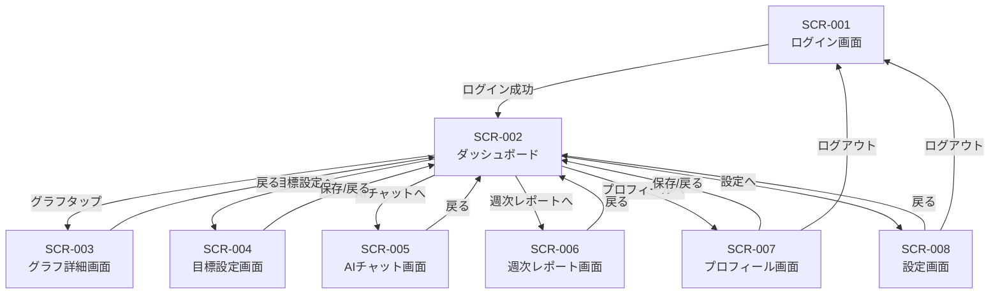

### 3.3 共通レイアウト

認証後の全画面（SCR-002〜SCR-008）は以下の共通レイアウトを持つ。

```
┌─────────────────────────────────────────────┐
│ ヘッダー: ロゴ / ナビゲーション / ユーザーメニュー │
├─────────────────────────────────────────────┤
│                                             │
│              メインコンテンツ                  │
│                                             │
├─────────────────────────────────────────────┤
│ モバイル: ボトムナビゲーション                    │
└─────────────────────────────────────────────┘
```

**ナビゲーション項目**:
- ダッシュボード（SCR-002）
- 目標設定（SCR-004）
- AIチャット（SCR-005）
- レポート（SCR-006）

---

## 4. データモデル

### 4.1 ER図

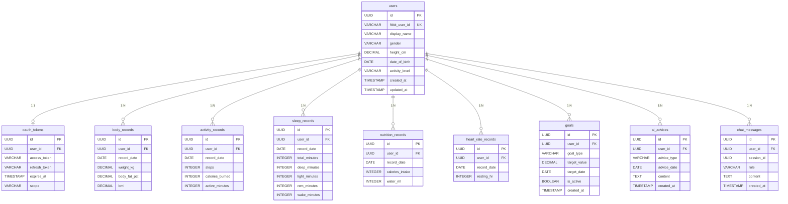

### 4.2 テーブル定義

#### users
| カラム | 型 | NULL | 説明 |
|--------|-----|------|------|
| id | UUID | NO | 主キー |
| fitbit_user_id | VARCHAR(64) | NO | Fitbit ユーザーID（ユニーク） |
| display_name | VARCHAR(255) | YES | 表示名 |
| gender | VARCHAR(16) | YES | 性別 |
| height_cm | DECIMAL(5,1) | YES | 身長(cm) |
| date_of_birth | DATE | YES | 生年月日 |
| activity_level | VARCHAR(32) | YES | 活動レベル |
| created_at | TIMESTAMP | NO | 登録日時 |
| updated_at | TIMESTAMP | NO | 更新日時 |

**インデックス**: `fitbit_user_id` (UNIQUE)

#### oauth_tokens
| カラム | 型 | NULL | 説明 |
|--------|-----|------|------|
| id | UUID | NO | 主キー |
| user_id | UUID | NO | FK: users.id |
| access_token | VARCHAR(1024) | NO | アクセストークン（暗号化） |
| refresh_token | VARCHAR(1024) | NO | リフレッシュトークン（暗号化） |
| expires_at | TIMESTAMP | NO | トークン有効期限 |
| scope | VARCHAR(255) | NO | 認可スコープ |

**インデックス**: `user_id` (UNIQUE)

#### body_records
| カラム | 型 | NULL | 説明 |
|--------|-----|------|------|
| id | UUID | NO | 主キー |
| user_id | UUID | NO | FK: users.id |
| record_date | DATE | NO | 記録日 |
| weight_kg | DECIMAL(5,2) | YES | 体重(kg) |
| body_fat_pct | DECIMAL(4,1) | YES | 体脂肪率(%) |
| bmi | DECIMAL(4,1) | YES | BMI |

**インデックス**: `(user_id, record_date)` (UNIQUE)

#### activity_records
| カラム | 型 | NULL | 説明 |
|--------|-----|------|------|
| id | UUID | NO | 主キー |
| user_id | UUID | NO | FK: users.id |
| record_date | DATE | NO | 記録日 |
| steps | INTEGER | YES | 歩数 |
| calories_burned | INTEGER | YES | 消費カロリー(kcal) |
| active_minutes | INTEGER | YES | アクティブ時間(分) |

**インデックス**: `(user_id, record_date)` (UNIQUE)

#### sleep_records
| カラム | 型 | NULL | 説明 |
|--------|-----|------|------|
| id | UUID | NO | 主キー |
| user_id | UUID | NO | FK: users.id |
| record_date | DATE | NO | 記録日 |
| total_minutes | INTEGER | YES | 合計睡眠時間(分) |
| deep_minutes | INTEGER | YES | 深い睡眠(分) |
| light_minutes | INTEGER | YES | 浅い睡眠(分) |
| rem_minutes | INTEGER | YES | レム睡眠(分) |
| wake_minutes | INTEGER | YES | 覚醒時間(分) |

**インデックス**: `(user_id, record_date)` (UNIQUE)

#### nutrition_records
| カラム | 型 | NULL | 説明 |
|--------|-----|------|------|
| id | UUID | NO | 主キー |
| user_id | UUID | NO | FK: users.id |
| record_date | DATE | NO | 記録日 |
| calories_intake | INTEGER | YES | 摂取カロリー(kcal) |
| water_ml | INTEGER | YES | 水分摂取量(ml) |

**インデックス**: `(user_id, record_date)` (UNIQUE)

#### heart_rate_records
| カラム | 型 | NULL | 説明 |
|--------|-----|------|------|
| id | UUID | NO | 主キー |
| user_id | UUID | NO | FK: users.id |
| record_date | DATE | NO | 記録日 |
| resting_hr | INTEGER | YES | 安静時心拍数 |

**インデックス**: `(user_id, record_date)` (UNIQUE)

#### goals
| カラム | 型 | NULL | 説明 |
|--------|-----|------|------|
| id | UUID | NO | 主キー |
| user_id | UUID | NO | FK: users.id |
| goal_type | VARCHAR(32) | NO | 目標種別（weight/steps/calories_burned/calories_intake） |
| target_value | DECIMAL(10,2) | NO | 目標値 |
| target_date | DATE | YES | 目標達成日（体重目標の場合） |
| is_active | BOOLEAN | NO | 有効フラグ（デフォルト: true） |
| created_at | TIMESTAMP | NO | 作成日時 |

**インデックス**: `(user_id, goal_type, is_active)`

#### ai_advices
| カラム | 型 | NULL | 説明 |
|--------|-----|------|------|
| id | UUID | NO | 主キー |
| user_id | UUID | NO | FK: users.id |
| advice_type | VARCHAR(16) | NO | 種別（daily/weekly） |
| advice_date | DATE | NO | 対象日 |
| content | TEXT | NO | アドバイス本文 |
| created_at | TIMESTAMP | NO | 生成日時 |

**インデックス**: `(user_id, advice_type, advice_date)`

#### chat_messages
| カラム | 型 | NULL | 説明 |
|--------|-----|------|------|
| id | UUID | NO | 主キー |
| user_id | UUID | NO | FK: users.id |
| session_id | UUID | NO | チャットセッションID |
| role | VARCHAR(16) | NO | 送信者（user/assistant） |
| content | TEXT | NO | メッセージ本文 |
| created_at | TIMESTAMP | NO | 送信日時 |

**インデックス**: `(user_id, session_id, created_at)`

---

## 5. 状態遷移図

### 5.1 ユーザー認証状態

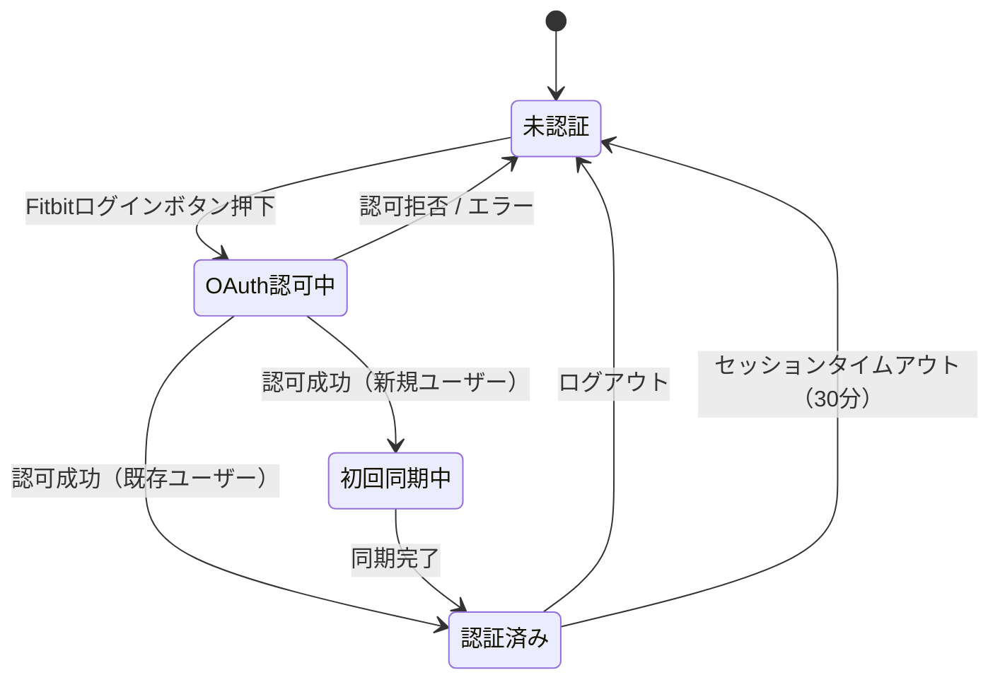

### 5.2 データ同期状態

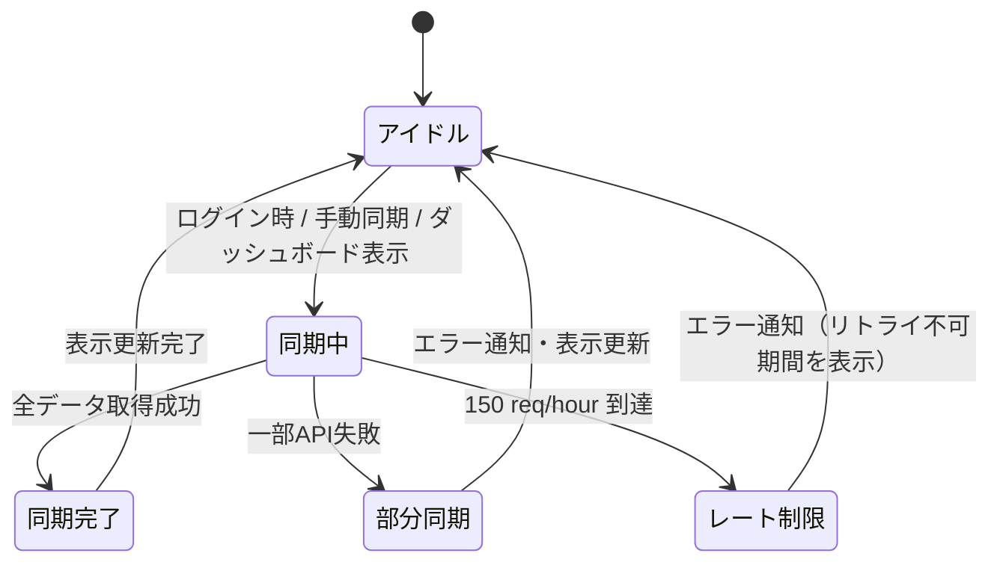

### 5.3 AIアドバイス生成状態

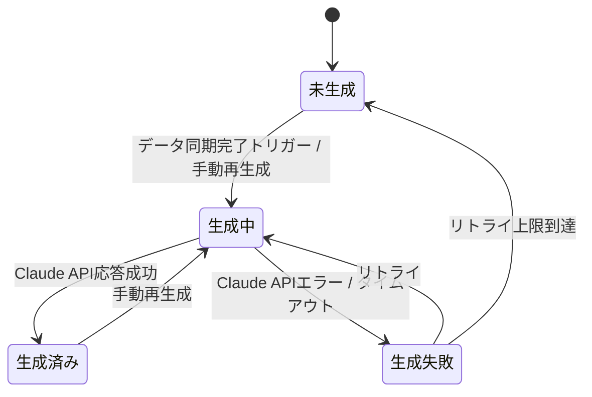

### 5.4 チャットセッション状態

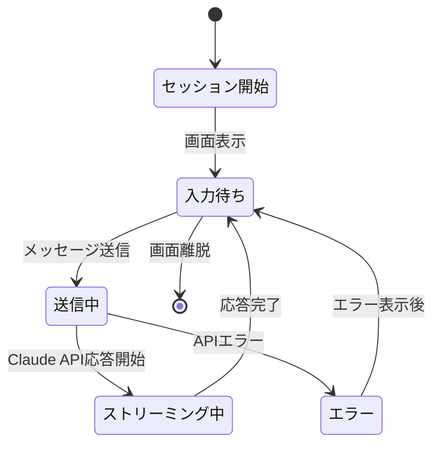

### 5.5 目標状態

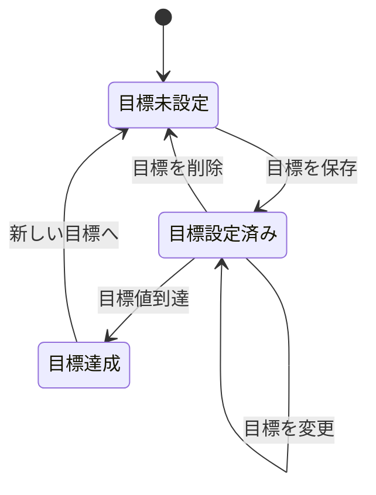

---

## 6. データフロー

### 6.1 全体データフロー

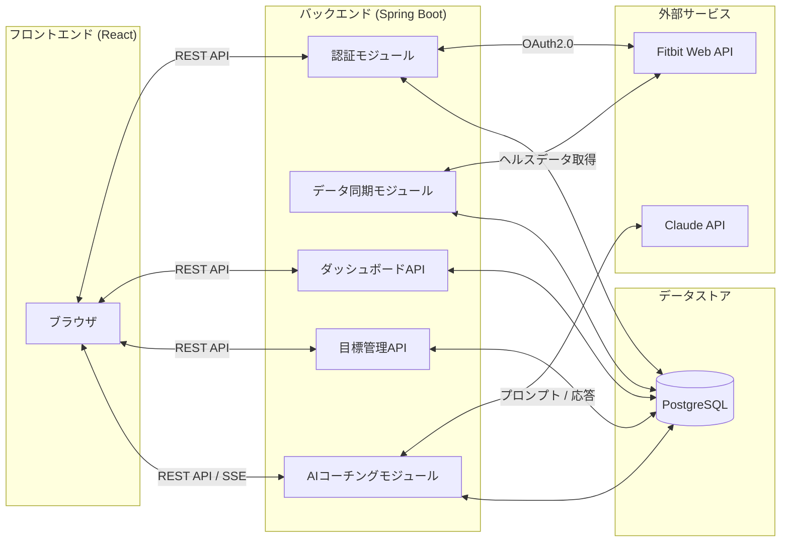

### 6.2 OAuth2.0 ログインフロー

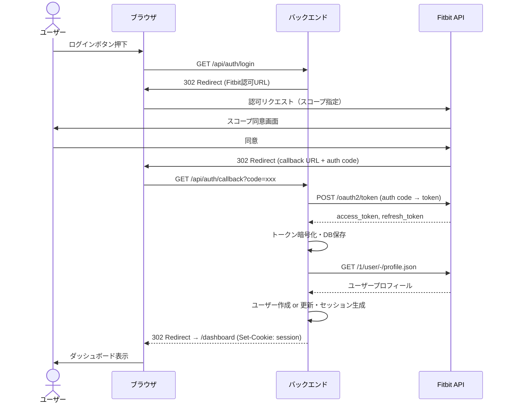

### 6.3 データ同期フロー

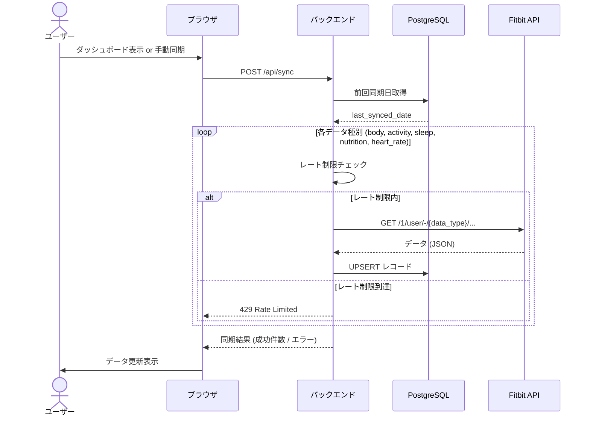

### 6.4 日次アドバイス生成フロー

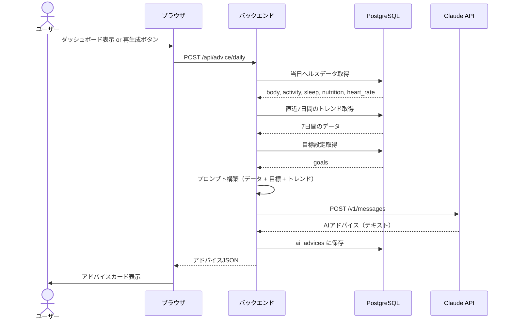

### 6.5 チャットコーチングフロー

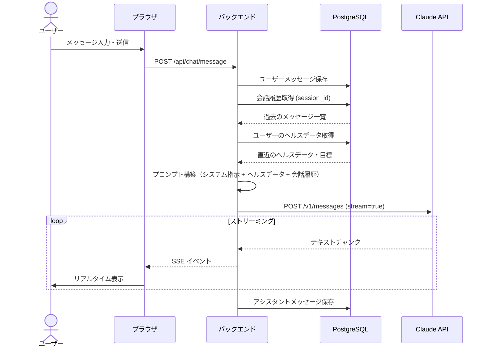

### 6.6 目標設定フロー

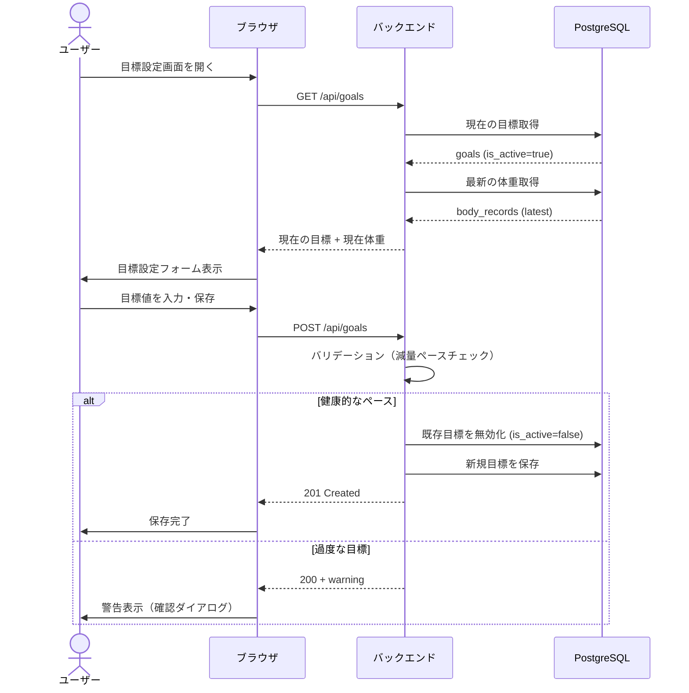

---

## 7. 外部API連携

### 7.1 Fitbit Web API

| API | エンドポイント | メソッド | 用途 |
|-----|---------------|---------|------|
| Get Profile | `/1/user/-/profile.json` | GET | プロフィール取得 |
| Get Body Weight | `/1/user/-/body/log/weight/date/{date}/{period}.json` | GET | 体重データ取得 |
| Get Body Fat | `/1/user/-/body/log/fat/date/{date}/{period}.json` | GET | 体脂肪データ取得 |
| Get Activity Summary | `/1/user/-/activities/date/{date}.json` | GET | 日次活動サマリー |
| Get Sleep Log | `/1.2/user/-/sleep/date/{date}.json` | GET | 睡眠データ取得 |
| Get Food Log | `/1/user/-/foods/log/date/{date}.json` | GET | 食事データ取得 |
| Get Heart Rate | `/1/user/-/activities/heart/date/{date}/{period}.json` | GET | 心拍データ取得 |
| Refresh Token | `/oauth2/token` | POST | トークンリフレッシュ |

**レート制限**: 150 requests/hour/user

**エラーハンドリング**:
| HTTPステータス | 対応 |
|---------------|------|
| 401 Unauthorized | トークンリフレッシュ→リトライ |
| 429 Too Many Requests | レート制限到達、ユーザーに通知 |
| 5xx | ログ記録、ユーザーに一時的なエラーを通知 |

### 7.2 Claude API (Anthropic)

| 用途 | エンドポイント | モデル | ストリーミング |
|------|---------------|--------|-------------|
| 日次アドバイス生成 | `POST /v1/messages` | claude-sonnet-4-5-20250929 | No |
| 週次レポート生成 | `POST /v1/messages` | claude-sonnet-4-5-20250929 | No |
| チャットコーチング | `POST /v1/messages` | claude-sonnet-4-5-20250929 | Yes (SSE) |

**エラーハンドリング**:
| ケース | 対応 |
|--------|------|
| 429 Rate Limited | 指数バックオフでリトライ（最大3回） |
| 5xx | ログ記録、「一時的に利用不可」をユーザーに通知 |
| タイムアウト (30秒) | リトライ1回、失敗時はエラー表示 |

---

## 更新履歴
- 2026-02-08: 初版作成（product-requirements.md から分割）
